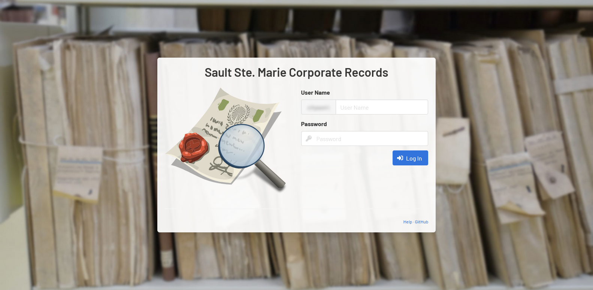

[Home](../readme.md)

# Help Documentation

**Thank you for taking the time to read the documentation.**

-   [Setup and Configuration](setup.md)
-   [Finding Records](search.md)
-   [Creating and Updating Records](createUpdate.md)
-   [Reporting Options](reporting.md)
