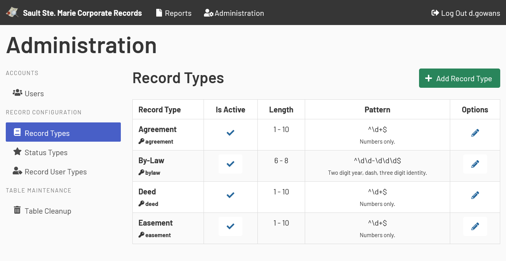

[Home](https://cityssm.github.io/corporate-records-manager/)
·
[Documentation](./)

# Administration

Administrators have the ability to make changes to the following configuration tables.

-   Users
-   Record Types
-   Status Types
-   Record User Types

These tables are documented in the [Setup documentation](setup.md).

## General Notes

-   Only items not associated with records can be fully removed.
    Items that cannot be removed can be hidden from view by being set as inactive.

-   When updating record types and status types, be sure not to change the meaning of the type.
    For example, if a status type of "New" is renamed to "Expired", all those records using that status will be updated as well.
    When in doubt, create a new type, and mark the old one as inactive.
