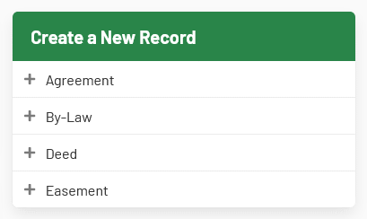
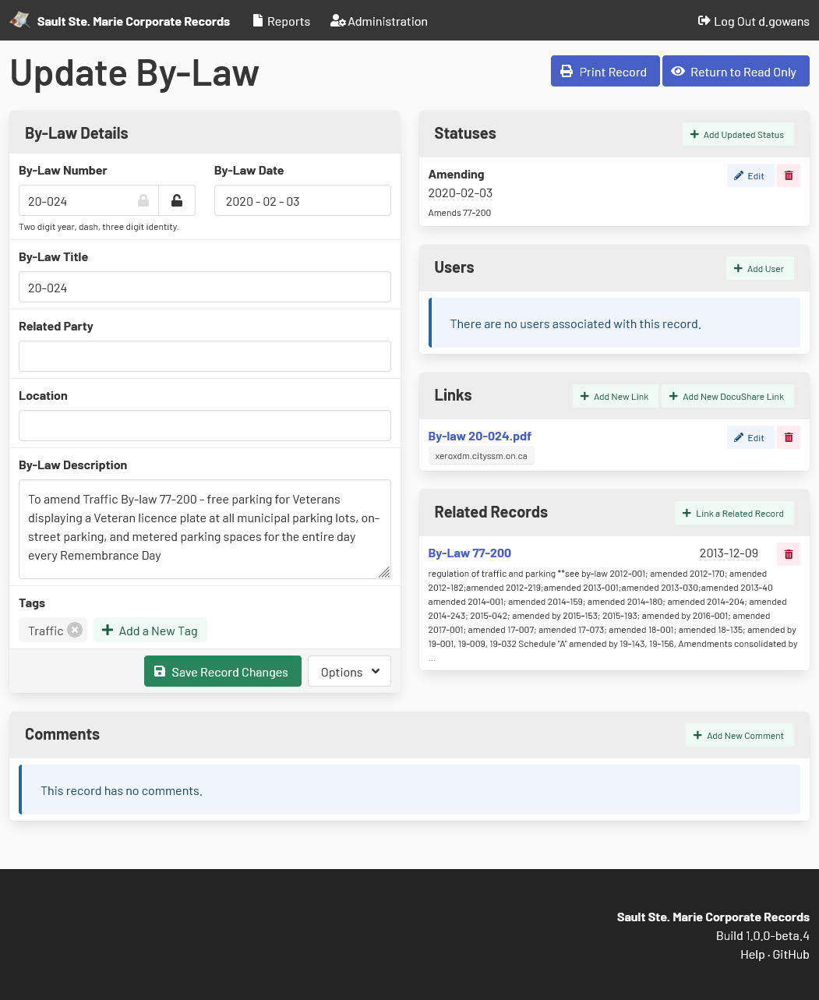

[Home](https://cityssm.github.io/corporate-records-manager/)
·
[Documentation](./)

# Creating and Updating Records

Creating and editing abilities are managed by user permissions.

New records can be created from the main dashboard by selecting the desired record type.

Records can be editing by selecting the **Edit Record** button at the top of the record view page.

When creating a new record, not all of the options will be available until the record is saved.

## Record Details

## Statuses

## Users

Users can be linked to a record to associate them with the record.
This can help track the users who are responsible for the record,
or may need to be notified if a record changes, for example.

Users don't need login access to the application to be associated with records,
but linking users in this way can affect what those users can see.
When used alongside the "Can View All" permission, users can be limited to
only see those records they are associated with.

## Links

Records can be linked to webpages.
When DocuShare integrations are enabled, options to search DocuShare collections are available.

## Related Records

## Comments

## Related Documentation

-   [Finding Records](search.md)
