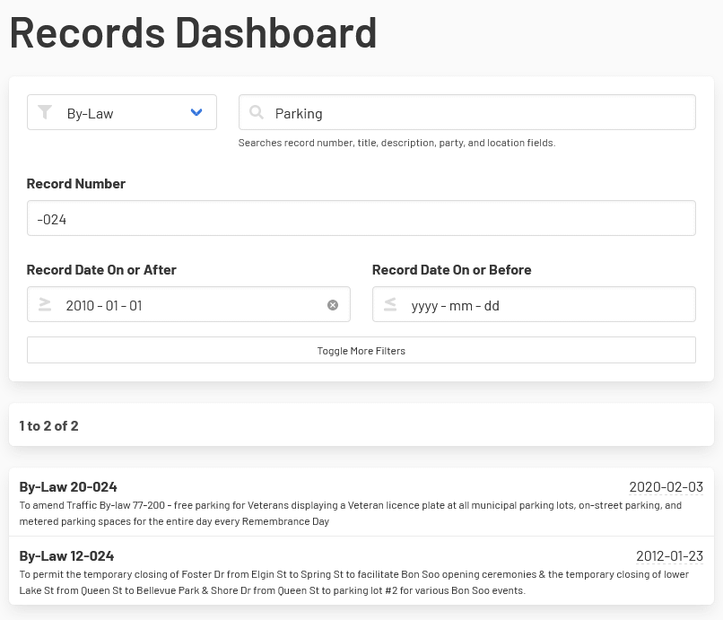

[Home](https://cityssm.github.io/corporate-records-manager/)
·
[Documentation](./)

# Finding Records

The search on the main dashboard offers filters to help find the records you are looking for.

Additional filters are hidden by default to reduce clutter.

Select any record to open the record for viewing, printing, or editing.

## Related Documentation

- [Creating and Updating Records](createUpdate.md)
